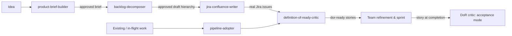

# AI-SDLC User Guide

A library of AI skills that supports an agile scrum team from a raw product idea to a closed, honestly-reported sprint. **12 skills are active today** (11 role skills + 1 meta skill); 6 more are built but deferred until their real-world trigger occurs. This page is the overview (Level 1). Each role has a workflow guide (Level 2), and each active skill has its own page (Level 3).

## The one idea that matters

**AI drafts, decomposes, critiques, and packages — humans decide.**

Every skill ends in a human approval gate: nothing is written to Jira, Confluence, or GitHub until the responsible person has reviewed and approved it. Gates come in three declared tiers (see `references/conventions.md`):

- **Per-item** — for edits to existing human-authored content and anything person-adjacent (escalations, record-notes on someone's work). You decide each item individually.
- **Per-run** — the default, for new-artifact creation. You approve the run's complete output set before anything is written.
- **Standing** — for recurring, read-only-analysis, template-pinned artifacts only (the daily digest). You approve format and destination once per sprint; runs then post automatically, and any unusual signal re-triggers the per-run gate.

Every run that writes externally keeps a live run log (`.ai-sdlc/runs/`), every artifact comes from a versioned template, and everything AI-created carries the `ai-sdlc-generated` label (`ai-sdlc-adopted` for adoption edits) — so "why did it write that?" is always answerable.

## Where things stand today

Honesty is a design value here, so, plainly:

- **Claude Code is the only proven surface.** The skills follow the open Agent Skills standard and are written surface-neutral, so GitHub Copilot and Atlassian Rovo distribution is planned — but neither is set up or validated yet. Until then, run skills in Claude Code or pair with someone who has it.
- **One live production run exists**: `pipeline-adopter` adopted an in-flight epic (KDP-40426) with item-by-item approved edits. Everything else has been validated by tabletop shakedowns — walking skills against real Jira/Confluence content, strictly read-only — not yet by live team use.
- **Developer skills are all deferred** pending repository access and the first real delegation/incident. What each will do when activated is in the [Developer guide](roles/developer.md).

## The PO pipeline

The core assembly line: each stage produces an artifact the next consumes, with a gate between every pair. The product brief lives **in the epic's own fields** (Background / Description / Requirements) — not in a separate document.

## Active skills by role

**Product Owner** ([role guide](roles/product-owner.md))
- [product-brief-builder](skills/product-brief-builder.md) — discovery interview → one rigorous brief in the epic's own fields
- [backlog-decomposer](skills/backlog-decomposer.md) — approved brief → draft Initiative → Epics → Stories with AC, sliced vertically; owns the living decomposition registry
- [jira-confluence-writer](skills/jira-confluence-writer.md) — approved decomposition → real Jira hierarchy; create-only, safe re-runs
- [definition-of-ready-critic](skills/definition-of-ready-critic.md) — entry and exit critic: readiness verdicts before refinement, per-AC evidence tables at acceptance
- [pipeline-adopter](skills/pipeline-adopter.md) — brings existing work into the pipeline; the one skill permitted to edit existing issues

**Tester** ([role guide](roles/tester.md))
- [test-plan-generator](skills/test-plan-generator.md) — AC-traced test cases with levels and automation flags; optional exploratory-charter section; AC gaps become PO findings
- [bug-report-writer](skills/bug-report-writer.md) — minimal deterministic repro, expected-vs-actual cited to AC, severity with rationale, correct KDP bug type

**Scrum Master** ([role guide](roles/scrum-master.md))
- [sprint-planning-facilitator](skills/sprint-planning-facilitator.md) — flow-first capacity math and draft goals; record mode captures the commitment baseline every other sprint skill depends on
- [sprint-radar](skills/sprint-radar.md) — one signal engine, two views: daily digest (standing gate) and escalation triage with evidence-backed drafts (per-item gate)
- [sprint-close](skills/sprint-close.md) — stakeholder report with flow metrics and the system scoreboard, blameless retro pack, action capture
- [backlog-hygiene-auditor](skills/backlog-hygiene-auditor.md) — cadence decay sweep with item-by-item approved cleanup; epic-closeout mode is the blocking gate at epic closure

**Meta**
- [tabletop-shakedown](skills/tabletop-shakedown.md) — stress-tests the library itself against real content, strictly read-only

## Deferred skills

Built, in the repo, and marked deferred in their own text. No individual guide pages until they activate — each has a named trigger, and un-deferring requires the trigger to have actually occurred:

| Skill | Activates when |
|-------|----------------|
| release-notes-generator (release runner: readiness go/no-go + notes) | The first real release routed through the pipeline |
| code-review-critic (single PR skill: hygiene pass + review pass) | Read access to a real `ap-*` repository |
| copilot-handoff-packager | The org's first real Copilot coding-agent delegation |
| tech-design-drafter (its template is usable standalone today) | A named request for a design doc |
| incident-hotfix-runner (owns the whole hotfix express path) | The first real production incident routed through the express lane |
| ac-playwright-scaffolder (generalizes to xUnit/Jest/Playwright at activation) | Test-repo access |

## Getting started

1. Read your role's guide — ten minutes: [Product Owner](roles/product-owner.md) · [Developer](roles/developer.md) · [Tester](roles/tester.md) · [Scrum Master](roles/scrum-master.md).
2. Pick your entry point: PO → `product-brief-builder` (new work) or `pipeline-adopter` (existing work); Tester → `test-plan-generator`; SM → `sprint-planning-facilitator`.
3. Run it in Claude Code on something real but small. The skill asks for what it needs; you approve what it produces.
4. Something wrong or missing? File an issue in this repo. `docs/skill-catalog.md` is the authoritative index; new skills, modes, and rules require a named requester after a live run — the library grows on demand signals, not speculation.
