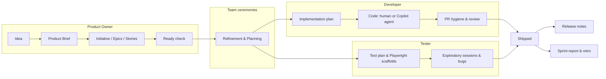

# AI-SDLC User Guide

A library of 23 AI skills that supports an agile scrum team across the whole software development lifecycle — from a raw product idea to shipped, tested, communicated software. This page is the overview (Level 1). Each role has its own guide (Level 2), and each skill has a detailed page (Level 3).

## The one idea that matters

**AI drafts, decomposes, critiques, and packages — humans decide.**

Every skill in this library ends in a *human approval gate*: nothing is written to Jira, Confluence, or GitHub until the responsible person has reviewed and approved it. The skills make your work faster and more rigorous; they never take a decision away from you. If a skill ever seems to be writing something you didn't approve, that's a bug — report it.

## What the system does, end to end

The skills form an assembly line along the value stream. Each stage produces an artifact the next stage consumes, with a human gate between every pair:

In plain terms:

1. A PO turns an idea into an approved **product brief**, decomposes it into an **Initiative → Epic → Story** backlog, writes it into Jira, and gates it with a **Definition-of-Ready check**.
2. The team refines and plans as usual — the Scrum Master skills prep every ceremony and capture its outcomes, so the humans spend the meeting deciding, not typing.
3. A developer turns a Ready story into an **implementation plan**, either builds it or **delegates it to the GitHub Copilot coding agent** with a bounded packet, and every PR gets **hygiene and a critical review** before a human merges.
4. A tester turns the same AC into a **test plan**, **Playwright scaffolds**, and **exploratory charters**; findings become well-formed **bug reports**.
5. What ships becomes **release notes** for stakeholders and **sprint reports/retro evidence** for the team.

## The three levels of this documentation

| Level | What | Where |
|-------|------|-------|
| 1 | This overview — the system as a whole | `docs/user-guide/README.md` |
| 2 | Your role's skills as a workflow | [Product Owner](roles/product-owner.md) · [Developer](roles/developer.md) · [Tester](roles/tester.md) · [Scrum Master](roles/scrum-master.md) |
| 3 | One page per skill — inputs, what you approve, what gets written | `docs/user-guide/skills/` (linked from every role guide) |

## Key concepts

- **Skill** — a versioned instruction module (a `SKILL.md` file) you invoke inside an AI surface to run one workflow. Single-purpose by design: one skill, one job, one approval.
- **Human approval gate** — the step in every skill where work stops until you approve. You'll always see *exactly* what will be written and where, before it is.
- **Systems of record** — outputs land in Jira and Confluence (and PRs in GitHub), not in a chat window. If it isn't in the system of record, it didn't happen.
- **`dor-ready`** — the label a story earns by passing the Definition-of-Ready check. Developer skills expect it; treat it as the ticket's passport into a sprint.
- **`ai-sdlc-generated`** — the label on every Jira issue a skill created, so AI-originated work is always auditable.
- **Run log** — every skill run writes a markdown audit file (`.ai-sdlc/runs/…`), updated live as the skill works: what context it read, every question and your verbatim answer, what you approved, and every external write it made. If a run ever needs troubleshooting, the log *is* the story.
- **Templates** — every artifact a skill produces comes from a versioned template, not freeform generation. That keeps output consistent as AI models change, and makes improvement concrete: don't fix the document, fix the template.
- **House AC style** — acceptance criteria live in the story's Acceptance Criteria field as `AC#N: title` blocks with **Given/When/Then**. Skills read and write this style consistently.

## Where you run the skills

- **GitHub Copilot (VS Code / Visual Studio)** — the primary surface today. Everyone has access; with the Atlassian MCP server configured, Copilot can read and write Jira/Confluence. Ask your team lead for the setup guide.
- **Claude Code** — works identically for those who have it.
- **Atlassian Rovo** — planned: PO/SM skills will be exposed as Rovo agents inside Jira/Confluence so no IDE is needed. Until then, POs can pair with anyone who has an IDE surface set up.

Skills are plain markdown following the open Agent Skills standard, so the same skill file works on all three surfaces.

## Trust, safety, and audit

- Nothing external is written before your approval — and you can stop any skill mid-run.
- Skills never invent facts: unknowns become tracked open questions, unverifiable claims are labeled as unverified, and vague AC get challenged, not papered over.
- Everything AI-created is labeled, linked, and traceable to its source (brief → issue → PR → release note).
- Every run leaves a run log (see key concepts above) — so "why did it write that?" is always answerable, and the logs' improvement notes drive skill and template upgrades.
- Skills are versioned in this git repository; changes to how they behave are reviewed like code. `docs/skill-catalog.md` is the authoritative index.

## Getting started

1. Read your role's guide (Level 2, links above) — ten minutes.
2. Pick the entry-point skill for your role: PO → `product-brief-builder`, Developer → `implementation-planner`, Tester → `test-plan-generator`, SM → `daily-standup-digest`.
3. Run it on something real but small. The skills ask for what they need; you approve what they produce.
4. Something wrong or missing? The library has a librarian: the `skill-author` meta skill scaffolds, audits, and catalogs skills — see [its page](skills/skill-author.md) or file an issue in this repo.
